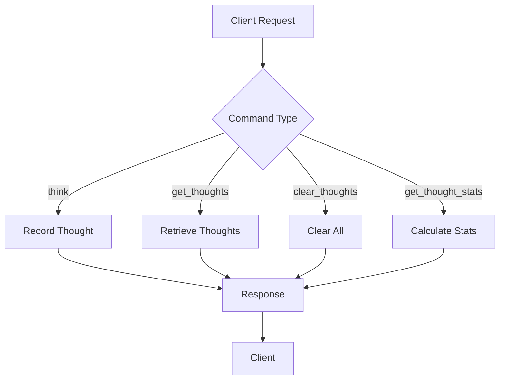
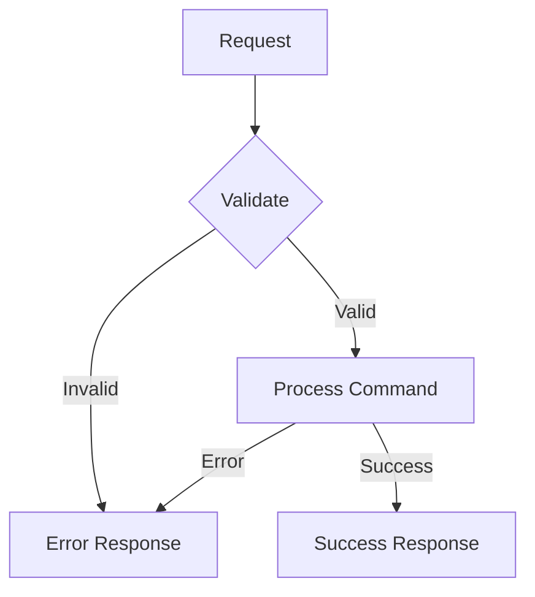

# Local Utilities MCP Server

This directory contains the MCP tools for the Local Utilities server. These tools provide quick access to common system and environment information, streamlining development workflows.

## Available Tools

### `get_time_and_date`

Returns the current local time and date in various formats.

**Example Response:**
```json
{
  "time": "3:30:45 PM",
  "date": "3/8/2025",
  "dayOfWeek": "Friday",
  "iso": "2025-03-08T15:30:45.123Z",
  "timestamp": 1741617045123
}
```

### `get_hostname`

Returns the hostname of the machine running the MCP server.

**Example Response:**
```json
{
  "hostname": "your-machine-hostname"
}
```

### `get_public_ip`

Returns the public IP address of the machine running the MCP server.

**Example Response:**
```json
{
  "publicIp": "203.0.113.1"
}
```

### `list_directory`

Lists the contents of a specified directory.

**Parameters:**
- `path` (string, required): Directory path to list

**Example Response:**
```json
{
  "path": "/path/to/directory",
  "contents": [
    {
      "name": "file.txt",
      "type": "file",
      "size": 1024
    },
    {
      "name": "folder",
      "type": "directory"
    }
  ]
}
```

### `get_node_version`

Returns the Node.js version information of the environment running the MCP server.

**Example Response:**
```json
{
  "nodeVersion": "v18.15.0",
  "details": {
    "node": "18.15.0",
    "v8": "10.2.154.26",
    "uv": "1.44.2",
    "zlib": "1.2.13",
    "brotli": "1.0.9",
    "ares": "1.19.0",
    "modules": "108",
    "nghttp2": "1.52.0",
    "napi": "8",
    "llhttp": "6.0.10",
    "openssl": "3.0.8",
    "cldr": "42.0",
    "icu": "72.1",
    "tz": "2022g",
    "unicode": "15.0"
  }
}
```

### `check_port`

Checks what process is running on a specific port.

**Parameters:**
- `port` (number or string, required): Port number to check (1-65535). String values will be automatically converted to numbers.

**Example Response (macOS/Linux):**
```json
{
  "processes": [
    {
      "command": "node",
      "pid": "12345",
      "user": "username",
      "fd": "12u",
      "type": "IPv4",
      "device": "0x1234567890",
      "size": "0t0",
      "node": "TCP",
      "name": "*:3000 (LISTEN)"
    }
  ],
  "message": "Found 1 process(es) using port 3000"
}
```

**Example Response (Windows):**
```json
{
  "raw": [
    "  TCP    0.0.0.0:3000           0.0.0.0:0              LISTENING       12345"
  ],
  "message": "Found 1 connection(s) on port 3000"
}
```

**Example Response (No Process):**
```json
{
  "message": "No process found using port 3000"
}
```

## Error Handling

All tools follow a consistent error handling pattern. If an error occurs, the response will include an `error` field with a message and details:

```json
{
  "error": "Failed to retrieve hostname",
  "details": "Error message details"
}
```

# Think Tool MCP Implementation

A simple thought recording and analysis tool implemented as an MCP utility.

## Protocol Documentation

### Commands

1. `think`
   - Records a new thought with timestamp
   - Parameters:
     - `thought` (string): The thought content to record
   - Response:
     - Success: `{ message: "Thought recorded successfully" }`
     - Error: Missing or invalid thought parameter

2. `get_thoughts`
   - Retrieves all recorded thoughts
   - Parameters: None
   - Response:
     - Success: `{ thoughts: Array<{ timestamp: string, content: string }> }`

3. `clear_thoughts`
   - Clears all recorded thoughts
   - Parameters: None
   - Response:
     - Success: `{ message: "All thoughts cleared" }`

4. `get_thought_stats`
   - Returns statistics about recorded thoughts
   - Parameters: None
   - Response:
     - Success: `{ totalThoughts: number, averageLength: number, oldestThought: string | null, newestThought: string | null }`

### Workflow



### Error Handling



## Example Usage

```typescript
// Record a thought
await mcp.request({
  command: 'think',
  params: { thought: 'Remember to update documentation' }
});

// Get all thoughts
const response = await mcp.request({
  command: 'get_thoughts'
});
console.log(response.data.thoughts);

// Get statistics
const stats = await mcp.request({
  command: 'get_thought_stats'
});
console.log(stats.data);
```

## Security Considerations

- All thought content is stored in memory
- No persistent storage, thoughts are cleared when server restarts
- Input validation for thought content
- No authentication/authorization (relies on MCP server security)

## Performance Characteristics

- O(1) for recording thoughts
- O(1) for retrieving thoughts (returns reference to array)
- O(n) for calculating statistics
- Memory usage grows linearly with number of thoughts
- No persistence layer, all in-memory operations 